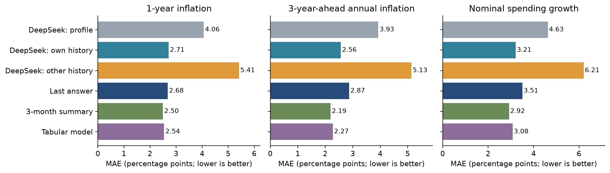
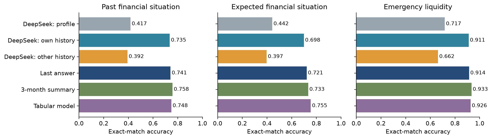
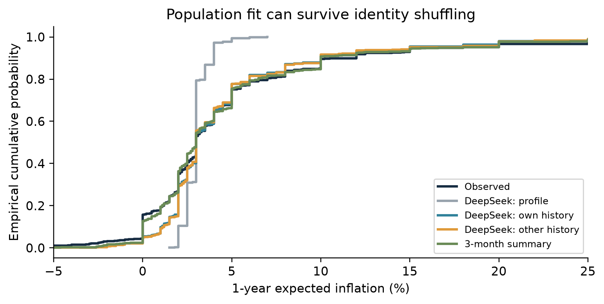
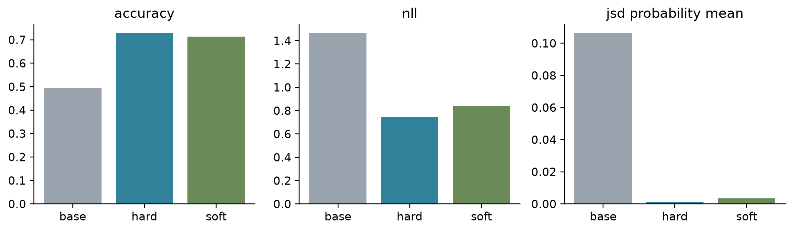
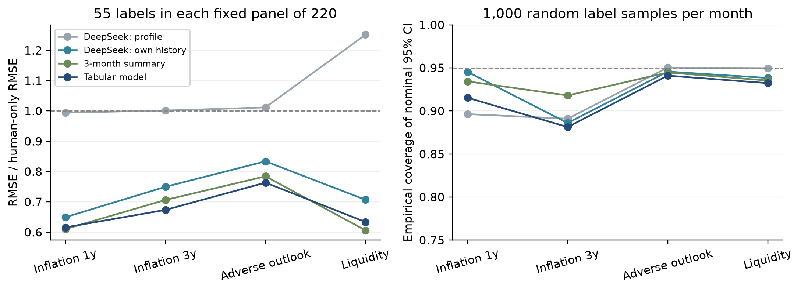

# 从“像受访者”到“有用的调查辅助”

## ECB Consumer Expectations Survey 项目接手、方向选择与实证报告

**完成日期：2026-09-30。研究对象：消费者的主观调查回答，不是实际通胀/财务结果预测。**

### 执行结论

建议保留上一组“哪些问题可以被模拟、哪些不行”的总目标，把下一阶段主线改为：**个人历史到底提供了多少信息，LLM是否比简单历史模型多提供价值，以及这些预测能否帮助少量真人答案更准确地估计特定总体指标。** 可行性已通过真实数据与实际API/本地实验验证，结果并不支持“直接以LLM替代真人问卷”。

1. 上一组已经完成了波次75的人设生成、A/B宏观context实验、去数字化context和概率分配pilot，以及多层指标与结构诊断。其核心发现是：宏观数字会锚定回答，合成个体之间差异过小；改善总体分布不等于识别真实个人。以下旧结果均标为原组报告自述，未宣称复现。
2. 新实验使用2025-2026同一公开版本的364,819条人-月记录、74,613人、11国。固定2026年1、3、6月660条配对测试记录、650人，实际完成六种DeepSeek V4.1 Flash提示条件，每种660次，以及132次独立重复调用。
3. DeepSeek在本人三期历史提示下，一年通胀MAE从4.062降到2.714个百分点，未来财务准确率从0.442升到0.698。**信息有用，但LLM增量未被普遍证明**：三期中位数的一年通胀MAE为2.496，表格模型未来财务准确率为0.755。加权口径下个别相对排名改变，因此不声称传统模型在所有设定都胜出。
4. 本地Qwen3.5-4B已完成基础模型、硬标签LoRA、历史转移软标签LoRA和验证集调温。未来财务准确率分别为0.494、0.729、0.714；概率质量与个体准确率需要分开读。两种适配都仅涉及最后一层450,560个参数，不代表所有微调方案的上限。
5. 真人残差校正在固定留存测试面板上能降低一些估计量的误差，简单历史/表格预测器常比LLM有效。通胀重尾答案造成t近似区间覆盖不足；因此“点估计有帮助”成立的范围比“可靠区间推断”更宽。

### 1. 上一组做了什么，结论是什么

已读Drive中38页最终报告的摘要、目录、PDF页34-37（正文页33-36，结论与未来工作）、June17th proposal，以及PROJECT_OVERVIEW.md全文，并核对代码交付目录。June11th文件属于更早的卫星甲烷/CH4Net项目，不混入CES结论。最终PDF通过浏览器可读但下载失败，本项目保留上述可见内容的阅读笔记，并未读取最终报告全部38页或持有原PDF。本次旧实验汇总也依赖完整项目总览，交付物路径与采用状态见README。

原管线把22个人背景变量解码并扩展为persona；从其整理后波次75数据（14,334人、171列）固定抽300人，100人先做模型screening，剩余200人扩展，screening答案复用。主回答管线可询问68项，但实际评分29项；headline的17项是15道分类加2道二元题。原组另有30个分布/量表评分项，不能误说主模型已回答全部。

|原实验|范围与结果（原组自述）|应如何解释|
|---|---|---|
|A无context vs B官方统计+中性事件句|300人，分类准确率0.492→0.514；country-mode 0.556；headline增益+0.022|改善有限，仍须看基线；另一按题聚合口径是+.025，不是第二次独立实验|
|总体分布|分类JSD .451→.400，数值Wasserstein 2.94→3.34|context不是所有指标都改善，且旧指标约定不能与新JSD直接比较|
|数值锚定|通胀中位数约2.5，真人约4.0；合成分布宽度约真人10%-15%|数字看起来合理不等于真实人群分布|
|D去数字化context|30人：B/D/真人通胀中位数2.5/3.5/4.6；两期限同答比例50%/27%/23%|缓解锚定，但没有解决群体同质化；30人不可与300人汇总混用|
|概率分配pilot|30人：模型最可能区间概率中位数22-30点，真人58-62点|个体内部更分散、个体之间更同质，可以同时存在|

原组已有random、permutation、country_mode、cluster_mode基线；permutation本来就用于演示“分布完美但不懂个人”。因此本次换历史检验是纵向延伸，不把该区分包装成首次发现。旧基线由真实波次分布构造；新基线严格只使用上期或2025数据，协议不同。原代码模块data_processing、model_implementation、evaluation与原始结果文件具有接手价值，但本次未执行原Sonnet实验，也不把DeepSeek的新分数当成Sonnet复现。

原组提出用个人旧答案与更早波次微调。方向合理，但“老受访者有历史 vs 新人没有历史”的组间比较不能单独识别历史作用：留存、进入时间与人口结构混杂。本次改为同一批人配对修改输入。没有同日真人重复作答，月度持久性也不是严格的人类test-retest上界。

### 2. 我们选择的方向与文献依据

**主线A：历史信息审计。** 保留人口背景提示，增加本人历史；再把完整轨迹换给同国同月其他人，保持历史长度、格式和时间顺序，破坏身份对应。用LOCF和三期摘要隔离“历史本身”的价值，再看LLM有无额外收益。Park等关于丰富个人信息的工作提供动机，不能把访谈模拟成绩当作CES保证。

**主线B：小模型概率适配。** Cao等的首token分布训练与Suh等SubPOP说明，优化群体分布不同于让模型输出单个看似可信答案。本次把现有本地Qwen变成五类概率预测器，比较硬标签与历史条件分布目标，并独立调温；这是一项单题机制实验。

**主线C：真人辅助的有限面板估计。** Krsteski等已将合成与rectification分开研究；PPI提供预测加真实残差的统计框架。我们引入相同真人标签预算下的无模型样本均值、简单历史预测器和LLM预测器，直接测试效率与区间覆盖，而非仅看生成质量。

不选择“单纯增加persona多样性”为主线：Persona Generators偏重可能人设的支持覆盖，不能保证各类人的密度、人口权重或真实预期分布。也不做“战争引起预期变化”的因果主张；跨三个月的回溯评测没有可识别事件因果效应的随机暴露或可信反事实。

以上都是已有方法的CES应用、可复用评测与负结果证据链，不声称新的统计理论或首创LLM调查模拟。[完整文献与开源清单](LITERATURE_AND_CODE.md)给出8篇论文、4项实现、适用边界与许可证核对。

### 3. 数据、变量与任务边界

数据来自[ECB官方页面](https://www.ecb.europa.eu/stats/ecb_surveys/consumer_exp_survey/html/data_methodological.en.html)，下载当前同一版本2025/2026月度CSV、背景文件、元数据和微观数据指南v9。原始文件哈希保存在source_checksums.json。当前文件包括wave61-78；同一人-波次键无重复，匿名ID跨月可关联，样本中没有跨国家ID。

|变量|本次目标|关键编码/限制|
|---|---|---|
|c1120|未来12个月价格变化预期|百分比，-100至100；不是实际通胀|
|c1220|从两年后到三年后那12个月的价格变化预期|年率，不是三年累计通胀|
|c6120|未来12个月名义支出相对过去12个月变化|-999为不知道，转缺失，不当作经济极端值|
|c3010|过去12个月家庭财务变化|1很差至5很好；相邻月参考窗口高度重叠|
|c3110|未来12个月家庭财务变化预期|1很差至5很好；校正实验用1/2类作为“变差”|
|c7010|能否支付一月收入规模的意外款项|0/1；资源明确包含信用、储蓄、亲友借款|

人口输入只取国家、公开性别分类、上期年龄组和上期收入五分位，**不是原组22变量persona的直接复制**。背景教育等时点不确定字段未进入模型。公开性别分类为保密而重编码，不用于推断真实性别身份。年龄组为18-34/35-49/50-70/71+，收入组为国别加权五分位。没有加入当前目标答案、当月宏观数字、姓名或受访者ID；API仅接收公开匿名属性及历史答案。

| 波次/月 | 当月全部 | 有连续历史 | 留存占比 | 抽样n | 加权有效n |
|---|---|---|---|---|---|
| 73.0/1月 | 20068 | 11931 | 59.5% | 220 | 90.4 |
| 75.0/3月 | 19922 | 11836 | 59.4% | 220 | 92.4 |
| 78.0/6月 | 18339 | 10852 | 59.2% | 220 | 109.3 |

连续三期历史与当前回答同时存在的人约占每期公开样本59%，主结论只覆盖这类留存面板。每月每国简单随机抽20人，共660人-月、650独立人。主表按这套国家均衡样本不加权；敏感性分析使用ECB横截面wgt除以国别入样概率。该权重既不能自动修正留存选择，也不能把结果升级为官方欧元区估计。每月加权有效样本量约90-109，国别小样本结果仅描述。

当前公开数据存在修订，DeepSeek/Qwen预训练污染也无法排除。严格滞后输入与2025训练可以控制本次代码中的标签泄漏，不能证明基础模型从未接触2026资料。本研究是**回溯模拟评测，不是事前实时预测**。

### 4. 实施与评测协议

表格模型训练使用wave64-72的94,850条记录、17,343人；通过匿名ID的确定性哈希保留20%不进入训练。测试中143条来自这些未见训练ID，但仍有真实历史，不能称为“无历史新招募者”。未见训练ID也不等于基础模型预训练未见。三个2026测试月不用于拟合表格模型、LoRA或温度。

DeepSeek使用官方模型别名deepseek-flash，官方模型列表与文档对应V4.1 Flash；非thinking，temperature=.7，每次独立输出六题JSON。保留完整prompt、API响应、时间与usage。远程别名可能更新，不能保证未来字节级重现。六题合并回答与上一组每题独立调用不同，可能影响题间相关结构，本次只在相同新协议内部比较。后续三种探索性对照在看过首轮结果后增加，不冒充预注册验证。

五类传统基线：上期国家中位/众数；本人上一期；最近三期中位/众数（众数并列取较小编码）；HistGradientBoosting（固定100轮、15叶、L2=10，数值绝对误差损失；未用2026标签调这些超参数）；同国标准化历史近邻中随机选一个2025 donor（k=20）。历史数值缺失只回退到上期国家基线，不填补当前真值。条件donor的用途是对照分布保持，不期待它最小化个体MAE。

数值题报告MAE、RMSE、Wasserstein、IQR比例、零值/整数堆积与Spearman；类别题报告准确率、balanced accuracy、JSD，财务题另报有序MAE。JSD是base2 Jensen-Shannon divergence，即scipy距离的平方，0概率按标准定义处理，不人为平滑。准确率与MAE只描述单一维度，不作为唯一好坏标准。Spearman是未加权相关，即使同表其他指标使用权重，也不称其为加权相关。

主要对比按受访者聚类、在国家内重抽2,000次，报告未加权配对95%百分位区间。区间没有多重比较校正，作为探索性证据；不把“未检出差异”写成统计等效。支出当前真值缺失65条，DeepSeek本人历史还会对两条已知真值回答null；因此支出MAE注明有效n，并提供所有主要方法共同有效案例的补充表。

### 5. 实证结果：历史有用，复杂度未必有用

#### 5.1 个人数值误差

| 方法 | 一年通胀 MAE | 三年年通胀 MAE | 支出增长 MAE |
|---|---|---|---|
| 上期国家中位/众数 | 4.060 | 3.985 | 4.453 |
| 本人上期答案 | 2.682 | 2.866 | 3.513 |
| 本人三期中位/众数 | 2.496 | 2.189 | 2.923 |
| 历史表格模型 | 2.540 | 2.274 | 3.083 |
| 条件donor抽样 | 3.730 | 3.496 | 4.257 |
| DeepSeek 人口属性 | 4.062 | 3.927 | 4.629 |
| DeepSeek 本人三期历史 | 2.714 | 2.561 | 3.215 |
| DeepSeek 随机他人历史 | 5.413 | 5.133 | 6.208 |

单位为百分点，越小越好。一年/三年通胀各n=660；支出基线与demo n=595、本人历史n=593、随机他人历史n=580。不同方法的支出弃答集合不同，不能只看未配对小数；完整的共同样本比较在spending_common_cases.csv。

本人历史大幅改善LLM，三期中位数则在主表三项数值MAE都更低。这意味着“history值得做”获得支持，“必须由LLM来消化history”尚未获得支持。本人历史LLM相对LOCF（只用本人上一期）在不同目标有正有负，六题区间均跨零：例如一年通胀增益-0.032，区间[-0.244,0.174]；未来财务增益-0.023，区间[-0.049,0.003]。这些LOCF比较不同于下表“三期中位/众数”的比较，全部区间见paired_bootstrap.csv。

#### 5.2 个人类别预测

| 方法 | 过去财务 | 未来财务 | 应急支付 |
|---|---|---|---|
| 上期国家中位/众数 | 0.518 | 0.505 | 0.733 |
| 本人上期答案 | 0.741 | 0.721 | 0.914 |
| 本人三期中位/众数 | 0.758 | 0.733 | 0.933 |
| 历史表格模型 | 0.748 | 0.755 | 0.926 |
| 条件donor抽样 | 0.653 | 0.642 | 0.909 |
| DeepSeek 人口属性 | 0.417 | 0.442 | 0.717 |
| DeepSeek 本人三期历史 | 0.735 | 0.698 | 0.911 |
| DeepSeek 随机他人历史 | 0.392 | 0.397 | 0.662 |

各题n=660。未来财务的表格模型准确率点估计最高；应急支付持久性很强，三期众数点估计最高，这里没有声称其稳定优于所有其他基线。过去财务题滚动窗口有11个月重叠，较高准确率部分来自目标结构和持久性，不能单独解释为模拟了人的推理。

| 目标 | 比较对象 | 本人历史LLM的增益 | 95%配对区间 |
|---|---|---|---|
| 一年通胀 | DeepSeek 人口属性 | +1.348 | [+0.952, +1.769] |
| 一年通胀 | 本人三期中位/众数 | -0.218 | [-0.433, -0.017] |
| 一年通胀 | 历史表格模型 | -0.174 | [-0.328, -0.021] |
| 三年时点年通胀 | DeepSeek 人口属性 | +1.366 | [+1.010, +1.735] |
| 三年时点年通胀 | 本人三期中位/众数 | -0.372 | [-0.581, -0.165] |
| 三年时点年通胀 | 历史表格模型 | -0.287 | [-0.439, -0.152] |
| 未来财务 | DeepSeek 人口属性 | +0.256 | [+0.213, +0.299] |
| 未来财务 | 本人三期中位/众数 | -0.035 | [-0.068, -0.003] |
| 未来财务 | 历史表格模型 | -0.056 | [-0.086, -0.027] |
| 应急支付能力 | DeepSeek 人口属性 | +0.194 | [+0.159, +0.231] |
| 应急支付能力 | 本人三期中位/众数 | -0.023 | [-0.041, -0.005] |
| 应急支付能力 | 历史表格模型 | -0.015 | [-0.032, +0.000] |

“增益”为比较对象MAE减本人历史LLM的MAE，或本人历史LLM准确率减比较对象准确率，因此正值才有利于LLM。负值区间不能倒读为LLM获胜。分类增益用比例单位，例如.05即5个百分点。

#### 5.3 总体分布与个人对应关系可以分离

一年通胀的IQR比例定义为合成答案IQR除以真人答案IQR，1表示宽度相等。人口属性提示为0.152，本人历史为0.909，随机他人历史为0.909。换人后宽度仍接近真人，但MAE从2.714变成5.413。未来财务的JSD分别为0.0098（本人）、0.0116（随机他人），准确率却从.698降到.397。

图仅显示-5%至25%范围，计算指标仍使用完整有效范围，不删除尾部。这里的“他人历史”是**故意错配、仍作为同一人的旧答案给模型**的安慰剂检验，目的是仅改变轨迹与身份对应。它不是“明确告诉模型这些是别人答案”的辅助案例策略，因此不能推出任何形式的他人数据都没有用。

联合结构仍有问题：本人历史LLM的一年/三年预期Spearman约.833，真人约.687；三期摘要约.773。把边际宽度恢复并不自动恢复全部个体信念关系。

#### 5.4 追加对照、跨月份与加权敏感性

| 提示方案 | 一年 MAE | 三年 MAE | 未来财务准确率 | 应急准确率 |
|---|---|---|---|---|
| DeepSeek 本人三期历史 | 2.714 | 2.561 | 0.698 | 0.911 |
| DeepSeek 本人一期历史 | 2.924 | 2.835 | 0.627 | 0.838 |
| DeepSeek 匹配他人历史 | 5.366 | 5.152 | 0.374 | 0.692 |
| DeepSeek 时间反转 | 2.856 | 2.468 | 0.662 | 0.909 |

匹配他人采用同国同月、年龄组/收入组/公开性别分类距离最小的无自匹配分配。匹配后仍明显不及本人，说明简单人口相似不能替代真实个体历史。三期比一期通常更好；时间反转对未来财务有一定影响，对数值题的证据不稳定。因此目前不能声称模型学会了可靠的动态更新规律，更可能主要利用历史水平和持久性。正常顺序相对反转的未来财务准确率增益为.036，95%区间[.003,.070]；一年通胀MAE增益为.142，区间[-.113,.407]；三年年通胀为-.093，区间[-.356,.154]。数值目标区间跨零，支持的是尚不确定而非统计等效。

不同月份的难度变化明显：本人历史LLM一年通胀MAE为1月1.866、3月3.060、6月3.215，三期中位数为1.619/2.961/2.907。这些月份并非同一批人的纯时间实验，不能将差值直接归因为某个宏观事件。143条未见训练ID子集中主要排序未发生足以证明LLM增量的反转，详细分题表保存在metrics.csv。

加权后一年通胀MAE：LLM 2.645、表格2.646、三期摘要2.694，较主表更接近；同一加权口径的过去财务准确率为LLM .738、表格 .716、摘要 .709，与不加权主表排序反转。因此正确结论是**没有跨题目、权重和月份一致的LLM优势**，而不是“LLM在每个数字上都输了”。95%权重截尾敏感性及国别描述表一并交付。

132条独立重复调用中，一年通胀完全相同率56.1%，平均绝对差0.687个百分点；未来财务完全相同率92.4%，应急支付97.7%。重复子样本的误差不能与660条全样本直接比较，也不代表第二次调用提高了质量。

### 6. 本地Qwen：微调是否可行、改善的是哪种目标

使用用户已有mlx-community/Qwen3.5-4B-8bit，Apple M3 Pro、18 GiB内存。本次运行的是MLX的Apple Metal后端，**不是PyTorch MPS**；无需新购云GPU，但确实使用本机集成GPU。原始权重未修改。

目标限定为c3110五类。训练集1,024条来自2025训练ID；2025的220条验证记录来自训练排除ID；2026沿用660条测试记录。五个答案编码均为单token（16-20），对这五个logit归一化。这些是受限答案集概率，不等于自由生成时所有合法/非法输出的概率。

基础模型只评分；硬标签LoRA使用五类交叉熵；软标签LoRA使用**同一1,024训练记录**按国家和上期c3110分组、各类别加1平滑所得的历史转移分布作为目标。软标签会丢失组内个体差异，并不是让模型直接匹配2026总体分布，更不是完整复现Cao/SubPOP。两种LoRA都训练最后一个完整attention block的q/v/o与MLP投影，rank8、scale16、dropout0，450,560个可训练参数，学习率5e-5、batch1、一轮1,024更新。

只根据2025验证NLL，从256/512/1024步中选checkpoint；硬标签选择512步，软标签选择512步。另在同一验证集上拟合单个温度，测试集只评估。该验证集同时承担checkpoint选择与温度估计，可能有选择乐观性，但没有使用2026标签调参。前31层冻结并缓存，同一token输入做数值等价检查；实际误差记录在selection.json，不用近似通过阈值代替事实。

| 本地方案 | 校准 | 准确率 | NLL | Brier | 概率均值JSD |
|---|---|---|---|---|---|
| Qwen基础 | 未调温 | 0.494 | 1.706 | 0.754 | 0.1456 |
| Qwen基础 | 验证集调温 | 0.494 | 1.465 | 0.709 | 0.1064 |
| 硬标签LoRA | 未调温 | 0.729 | 0.745 | 0.392 | 0.0012 |
| 硬标签LoRA | 验证集调温 | 0.729 | 0.744 | 0.392 | 0.0011 |
| 转移分布LoRA | 未调温 | 0.714 | 0.847 | 0.437 | 0.0043 |
| 转移分布LoRA | 验证集调温 | 0.714 | 0.837 | 0.436 | 0.0035 |

NLL、Brier与JSD越小越好；多类Brier为五项平方差之和。概率均值JSD用每人的概率向量先平均，再与真人类别频率比较；它与argmax答案分布JSD不同，后者也已保存。调温不会改变argmax，所以同一模型调温前后准确率相同。

硬标签LoRA将准确率从49.4%提高到72.9%，NLL从1.706降至0.745，说明它学到了可用的本任务预测关系。软标签方案的NLL和Brier较硬标签差；“分布目标”这个名称本身不是优势证据。硬标签相对基础模型的准确率增益为23.5个百分点，按国家分层、受访者聚类的探索性95%区间为[19.1,27.7]个百分点。

主表的表格模型使用94,850条训练记录，不能把它与1,024条LoRA的差距全部归因于架构。为此追加以下同预算对照，全部使用与LoRA相同的1,024条训练和220条验证记录：表格模型沿用固定超参数；直接转移频率把国家×上期答案的平滑五类频率直接用作预测，不经过语言模型。该追加比较是在看到Qwen结果后进行的探索分析。

| 同1024条训练记录对照 | 校准 | 准确率 | NLL | Brier | 概率均值JSD |
|---|---|---|---|---|---|
| 表格模型 | 未调温 | 0.703 | 0.785 | 0.415 | 0.0024 |
| 表格模型 | 验证集调温 | 0.703 | 0.769 | 0.408 | 0.0007 |
| 直接转移频率 | 未调温 | 0.677 | 0.948 | 0.481 | 0.0084 |
| 直接转移频率 | 验证集调温 | 0.677 | 0.937 | 0.477 | 0.0052 |

硬标签LoRA相对同预算表格的准确率点估计高2.58个百分点，但95%配对区间[-0.61,5.94]跨零，不能声称稳定胜出；其调温后NLL .744低于表格.769，表格的总体概率JSD却更小（.0007 vs .0011）。这再次说明预测与分布目标不能混为一谈。硬标签相对三期众数的准确率差为-0.45个百分点，区间[-2.43,1.66]，相对大训练集表格为-2.58个百分点，区间[-5.00,-0.30]。完整对照及143条训练排除ID切片见qwen_probability_controls.csv、qwen_paired_bootstrap.csv和qwen_slices.csv。DeepSeek一次答六题、Qwen只答一题，跨模型差异不能单独归因为参数规模或微调。

这些实验确认本地轻量适配在计算上可行，也明显改善原始Qwen，但尚未确立它相对简单历史规则的优势。不能以单模型、单题、单训练种子、1,024条训练和末层LoRA的结果推断“微调普遍成功/失败”；也不能因为群体JSD下降便称每个合成人更真实。冻结前缀与完整前向在两个最终adapter的各三条核对记录上，五个logit最大绝对误差均为0.0；此检查支持实现一致性，不是模型质量指标。

### 7. 少量真人答案辅助总体估计

每月固定本次220条测试记录为有限总体，真实均值可由完整观察数据计算。随机不放回抽55或110条当作可见真人标签，其余标签隐藏；每个配置重复1,000次。所有方法使用同一次随机抽样，模型预测固定在抽标签前。对c3110估计“未来财务变差”比例，对c7010估计“具备支付能力”比例；通胀保留原百分比均值。

对预先固定的预测f，差分估计为：

**估计均值 = 全部N人的预测均值 + n名随机真人的平均(真实值 - 预测值)。**

在这个有限总体简单随机抽样设计下，估计量对随机标签抽样是无偏的，不要求模型正确。方差估计用残差样本方差乘(1-n/N)/n，95%区间用t(n-1)近似。纯真人对照就是随机可见标签的样本均值，相当于f=0；它不是“人类预测”。我们固定残差系数为1，没有利用测试标签调lambda，也不声称使用了PPI++最优系数。

| 估计目标 | 辅助预测器 | RMSE | 区间覆盖率 | 方差比 |
|---|---|---|---|---|
| 一年通胀 | 纯真人样本均值 | 0.971 | 0.897 | 1.00 |
| 一年通胀 | 本人三期中位/众数 | 0.605 | 0.934 | 2.81 |
| 一年通胀 | 历史表格模型 | 0.610 | 0.915 | 2.76 |
| 一年通胀 | DeepSeek 本人三期历史 | 0.639 | 0.945 | 2.43 |
| 三年时点年通胀 | 纯真人样本均值 | 1.001 | 0.890 | 1.00 |
| 三年时点年通胀 | 本人三期中位/众数 | 0.710 | 0.918 | 2.23 |
| 三年时点年通胀 | 历史表格模型 | 0.688 | 0.881 | 2.42 |
| 三年时点年通胀 | DeepSeek 本人三期历史 | 0.758 | 0.886 | 1.83 |
| 未来财务变差比例 | 纯真人样本均值 | 0.056 | 0.943 | 1.00 |
| 未来财务变差比例 | 本人三期中位/众数 | 0.044 | 0.945 | 1.66 |
| 未来财务变差比例 | 历史表格模型 | 0.043 | 0.941 | 1.76 |
| 未来财务变差比例 | DeepSeek 本人三期历史 | 0.047 | 0.946 | 1.45 |
| 应急支付能力 | 纯真人样本均值 | 0.050 | 0.947 | 1.00 |
| 应急支付能力 | 本人三期中位/众数 | 0.030 | 0.935 | 2.73 |
| 应急支付能力 | 历史表格模型 | 0.031 | 0.932 | 2.50 |
| 应急支付能力 | DeepSeek 本人三期历史 | 0.035 | 0.938 | 2.01 |

表中为每月55真人标签、三个测试月份指标的算术均值。方差比是**纯真人均值的Monte Carlo方差 / 校正估计方差**，大于1表示方差下降；不能直接解读为同等比例访谈人数或成本节省，因为本设计有25%抽样率及有限总体修正。110标签、每月原始结果和未校正偏差均在correction.csv。

适用结论：预测器与当前答案相关时，残差校正可提高有限面板点估计精度；本人历史有价值，LLM并非必要。随机错配历史可能增大残差方差，分布像真人并不足以带来统计效率。二元比例区间覆盖通常更接近名义水平，但不是所有配置都达到95%；1,000次抽样下覆盖率的Monte Carlo标准误约0.007（在95%附近）。

数值通胀的极端值使t近似区间在本表数值目标中欠覆盖，不能宣称已解决可靠总体推断。研究下一步应优先处理重尾均值的区间方法或明确改变为稳健统计量，并重新验证；不能删极端值后仍声称估计同一原始均值。本实验只针对固定留存面板的随机隐藏标签，没有模拟真实新增招募、非应答、复杂抽样或机构运行成本。

### 8. 研究可行性判断与建议提交的proposal

建议题目：**Individual Histories, Simple Baselines, and Human-Calibrated Estimates in LLM Simulations of the ECB Consumer Expectations Survey**。

建议核心问题：在给定历史信息和真人调查量的条件下，LLM究竟在哪些目标上增加价值？把“模拟某个人”“匹配群体分布”“帮助估计群体统计量”作为三项不同任务，分别评价。

|方向|本次证据|决策|
|---|---|---|
|个人历史提示|各目标相对人口属性提示大幅改善，身份错配明显变差|保留，作为信息价值实验主线|
|LLM替代简单历史预测|主表多项不及三期摘要/表格；加权有个别反转|不作为既定结论，报告增量缺乏稳定性|
|提高persona多样性|支持覆盖目标不能保证密度和个人对应|仅作预试/压力测试辅助，不作为代表性方案|
|小模型概率适配|本地可运行，准确率/校准/分布分别得到实测|保留为次级方法对照，避免单题推广|
|真人残差校正|有限面板均值/比例误差可下降；简单模型也有效|最有实际用途的方向之一，明确重尾区间未解决|
|直接替代真实调查/解释战争因果|缺少代表性、实时性、因果识别与成本证据|本报告不支持|

这套proposal的可交付研究贡献是：一个严格滞后、配对、三个测试月的CES应用评测；一个把身份对应与边际分布拆开的纵向检验；在相同真人标签量下，对LLM和简单预测器进行校正效率/覆盖率比较。方法来源、探索性分析和结果边界均应明确，不夸大为新理论。

### 9. 完整性、复现与运行记录

正式统计只读取修正后的deepseek_raw.jsonl。早期c7010题干误写为不包含借款，已返回830条输出全部隔离在deepseek_invalid_wording_excluded.jsonl，六题均不进入正式结果。网络错误41条保留在正式日志里，失败组合随后补齐；有效六臂各660、重复臂132。误写/网络问题没有被当成模型能力结论。

另有一次thinking审查只返回推理、未返回最终文字，以及一次审查请求网络超时；之后已取得正式审查。DeepSeek审查本身也出现了错误：把完整轨迹换人说成时间打乱、误认为完整面板权重也要除抽样概率、误读纯样本均值对照。均由代码和公式复核，不把外部模型的“通过”当作质量证明。完整审查与逐项回应保存在review-stage。

正式有效实验响应合计2,780,672 tokens；废弃题干响应522,940 tokens，已返回审查响应41,981 tokens，全部计入以下估算。连同废弃题干和已返回审查响应，按[DeepSeek当前公开价](https://api-docs.deepseek.com/quick_start/pricing/)估算为US$0.55-1.10（低峰/高峰范围）。这是基于返回usage的估算，未返回请求可能计费，不能当成实际账单；Codex会话用量、本机电费和既有模型获取成本未计入。

复现顺序：prepare_data.py → run_baselines.py → run_deepseek.py（主实验、--repeat、--ablation）→ prepare_qwen.py → run_qwen.py（base/hard/soft）→ analyze.py → supplementary.py → analyze_qwen.py → qwen_controls.py → make_figures.py → build_report.py。具体命令与环境在README.md；API会产生费用，原始结果与adapter已交付，可仅离线重算指标。

当前项目没有复现原组Sonnet分数，没有重跑所引论文的完整原始训练，也没有证明所有CES问题适用、实时未来预测有效、或官方人口估计有效。这里的“完整报告”是对已选定可行方案的完整实施、证据与限制说明，而不是把尚未验证的外推填成成功。

### 10. 引用与数据致谢

完整书目与开源代码链接见后附文献清单。数据来源为ECB Consumer Expectations Survey，所有本次图表为本地计算。原组材料源自用户提供的[项目Drive](https://drive.google.com/drive/folders/15HiwT5CUMDAhu18zeVsp1Sq403BUVzpl)，引用原组结论不表示独立验证。

**This paper uses data from the ECB Consumer Expectations Survey.**

Source: ECB Consumer Expectations Survey.

---

# 文献、开源实现与本项目适用性

检索/核对日期：2026-09-30。优先论文原文、ACL Anthology、作者项目和官方代码。定向查找CES合成受访者与PPI应用未得到足以证明“首次”的证据，因此不使用“首个/全新方法”表述。

|文献|已核对的证据与用途|能支持什么 / 不能支持什么|
|---|---|---|
|Argyle et al. (2023), *Out of One, Many: Using Language Models to Simulate Human Samples*, Political Analysis 31(3):337-351. DOI 10.1017/pan.2023.2. [原文](https://doi.org/10.1017/pan.2023.2)|人口属性条件化的“silicon samples”出发点；核对出版页面/摘要|支持设置人口学提示基线；不能保证欧元区经济预期的个体预测准确|
|Bisbee et al. (2024), *Synthetic Replacements for Human Survey Data? The Perils of Large Language Models*, Political Analysis 32(4):401-416. DOI 10.1017/pan.2024.5. [原文](https://doi.org/10.1017/pan.2024.5)|平均值相近仍可伴随方差不足、回归结构偏差和提示/时间敏感性；核对出版页面/摘要|支持同时检查个人、分布、结构与重复调用；不把其他调查的失败幅度照搬CES|
|Park et al. (2024), *Generative Agent Simulations of 1,000 People*, arXiv:2411.10109. [论文](https://arxiv.org/abs/2411.10109)|已下载原文；以1,052人的丰富访谈为信息源。85%是相对真人自身复测一致性的比例，不是85%绝对准确率|支持“更丰富个人信息可能有效”；访谈与三期结构化CES历史并不等价|
|Cao et al. (2025), *Specializing Large Language Models to Simulate Survey Response Distributions for Global Populations*, NAACL:3141-3154. DOI 10.18653/v1/2025.naacl-long.162. [论文](https://aclanthology.org/2025.naacl-long.162/)|已下载原文；以首token概率匹配国家层面文化调查回答分布|支持概率分布目标；本次历史条件转移软标签LoRA是简化适配，不是论文完整复现|
|Suh et al. (2025), *Language Model Fine-Tuning on Scaled Survey Data for Predicting Distributions of Public Opinions*, ACL:21147-21170. DOI 10.18653/v1/2025.acl-long.1028. [论文](https://aclanthology.org/2025.acl-long.1028/)|核对正式出版元数据和摘要；SubPOP包含3,362题、约70K子群-响应对|说明面向子群分布的微调已有成熟方向；其跨题型规模远大于本次单题LoRA，不可等同|
|Krsteski et al. (2026), *Valid Survey Simulations with Limited Human Data: The Roles of Prompting, Fine-Tuning, and Rectification*, ACL July 2026:10887-10906，DOI 10.18653/v1/2026.acl-long.498；预印本arXiv:2510.11408 (2025). [论文](https://aclanthology.org/2026.acl-long.498/)|已下载原文；比较合成与真人残差修正，作者代码可用|直接支持把“合成是否像人”与“辅助总体估计是否有效”分开；不能把论文的偏差或样本效率增益当成CES结果|
|Angelopoulos et al. (2023), *Prediction-Powered Inference*, arXiv:2301.09633. [论文](https://arxiv.org/abs/2301.09633)|核对原始摘要与作者工具库；预测加真人残差用于统计估计|支持差分估计框架；本次固定有限面板、无放回抽样与t近似区间是特定设计，不是对复杂CES调查设计的通用有效性证明|
|Paglieri et al. (2026), *Persona Generators: Generating Diverse Synthetic Personas for Arbitrary Contexts*, arXiv:2602.03545. [论文](https://arxiv.org/abs/2602.03545)|已下载v2原文；多样性/支持覆盖目标与人口分布密度目标不同|适合调查预试的极端情景覆盖；不作为提高CES代表性的主要方案。未确认可直接复用的作者公开仓库|

## 可直接采用的工程资源

|资源|核对状态|本次采用方式|
|---|---|---|
|[survey-simulations](https://github.com/skrsteski/survey-simulations)|作者仓库、MIT；commit d0926093b57b373760679c4b6d7ef01d4447c387|参考“生成+校正”的分离评价设计。本次自行实现有限面板差分估计，不安装整个Axolotl训练栈|
|[SimLLMCultureDist](https://github.com/yongcaoplus/SimLLMCultureDist)|作者仓库；commit 402ee0b350983fd665e6668d770c7a687c5669a6；GitHub未列出顶层许可证|参考首token分布目标，不复制未明确授权的实现；原始多卡/SLURM脚本不直接用于Mac|
|[ppi_py](https://github.com/aangelopoulos/ppi_py)|作者库、MIT，commit见code_manifest.json|公式与接口参考；独立有限总体实现加入无放回抽样修正，避免直接套默认超总体方差|
|[MLX-LM](https://github.com/ml-explore/mlx-lm)|官方Apple Silicon运行/微调库、MIT；使用本机已安装版本|加载现有Qwen3.5-4B 8bit，Metal运行、最后一层LoRA，保留原权重|

仓库快照清单为 `sources/papers/code_manifest.json`。前三个研究仓库只做只读核对/方法参考，不能称为本次已经完整重跑原论文。实际执行的是本项目`scripts/`内的适配实现及已安装MLX-LM。

## 数据支持链

[ECB官方数据与方法页面](https://www.ecb.europa.eu/stats/ecb_surveys/consumer_exp_survey/html/data_methodological.en.html)公开月度CSV、背景CSV、元数据和微观数据指南。稳定匿名ID允许纵向关联；数据含目标六题及国家、年龄、收入组、横截面权重。取同一当前release的2025和2026资料避免跨旧版本ID变更。由此可以直接实施滞后预测、返回面板、跨月份比较和随机隐藏标签的校正实验，无需等待新增数据采集。

This paper uses data from the ECB Consumer Expectations Survey. Source: ECB Consumer Expectations Survey.
